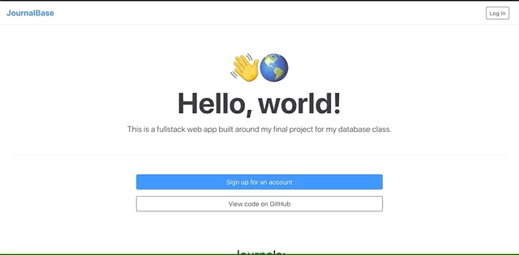
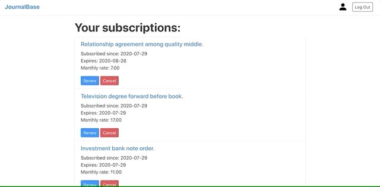
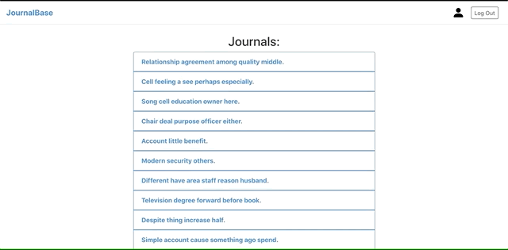
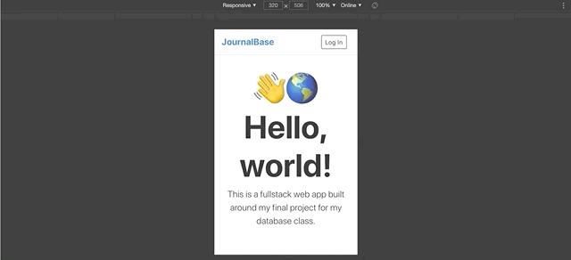

# JournalBase
**A web app that imitates an e-journal library.**

## Demo
#### Signing up and logging in

#### Managing journal subscriptions

#### Viewing journal articles

#### Responsive design

## Stack
* Front-end: React, Bootstrap
* Back-end: Node.js, Express, Postgres

## License
\
This work is licensed under a [Creative Commons Attribution-NonCommercial-ShareAlike 4.0 International License](https://creativecommons.org/licenses/by-nc-sa/4.0/).
